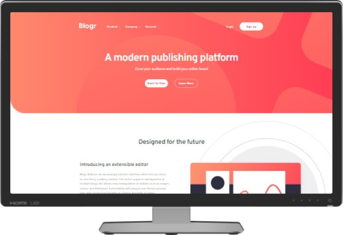

<h1 style="text-align: center">Blogr Landing Page 👨‍💻</h1>
<h2 style="text-align:center"><a href="">FEM</a>&nbsp;Challenge</h2>

---

## What's this? 🤔

Hi there! 👋 This is my solution for the **Blogr Landing Page** **[FEM](https://frontendmentor.io/)** challenge.

### Tools used 🧰

- [NodeJS](https://nodejs.org/)
- [Vite](https://vitejs.dev/)
- [React](https://reactjs.org/)
- [Tailwind](https://tailwindcss.com/)
- [PostCSS](https://postcss.org/)
- [Firefox](https://www.mozilla.org/en-US/firefox/)
- [Visual Studio Code](https://code.visualstudio.com/)

### [🎨 Live preview 🎨]()

|  |  |  |
| ----------------------------------------- | ----------------------------------------- | ------------------------------------------ |
